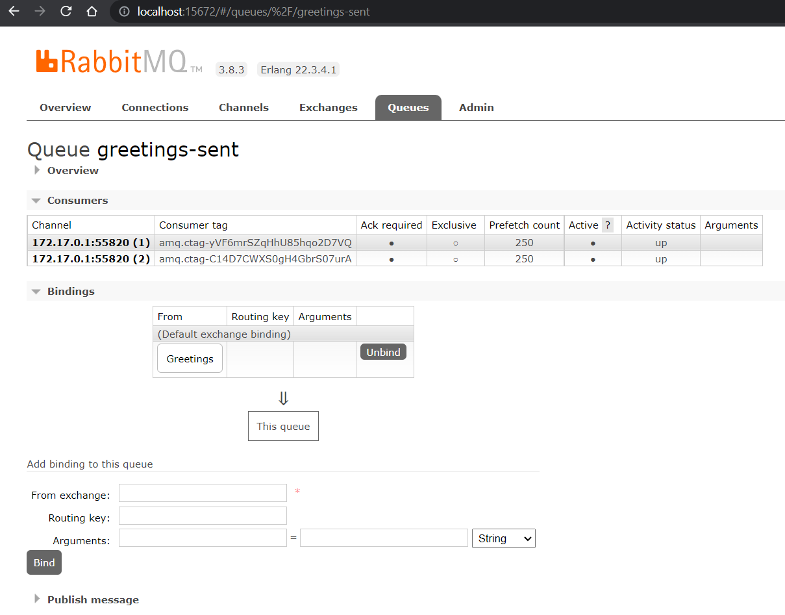

# Projeto de Microsserviços com Mensageria com Spring Boot

Neste projeto, você irá praticar a codificação de aplicações que utilizam sistemas de mensageria, segundo uma arquitetura orientada a eventos, podendo reaproveitar ou não a estrutura de microsserviços. Caso você queira reaproveitar, este tutorial será uma continuação do anterior, porém, se você optar por criar apenas um microsserviço isolado, basta dispensar as dependências e configurações relacionadas ao projeto Spring Cloud e criar um monolito com as configurações relacionadas a troca de mensagens.

## Ferramentas para implantação de Arquitetura Orientada a Eventos

Considere a crescente realidade de desacoplamento e independência no seguinte exemplo: determinados microsserviços ou aplicações A e B precisam de alguma informação que possui algum tipo de estado em uma outro microsserviço ou aplicação C, ou seja, é necessário que C "avise" as outras duas que algo mudou.

Como uma API não guarda estado, seria preciso, no mínimo, construir uma solução para estar informando as aplicações A e B as mudanças das informações da aplicação C. Essa é uma clara necessidade de troca de dados entre aplicações, o que chamamos de mensagens.

Recordando a ilustração de uma arquitetura de microsserviços do tutorial anterior, da figura exibida a seguir considere os microsserviços *Spring Boot Apps* necessitando de trocar mensagens sobre atualizações de informações através de um message broker.


Para esse tipo de situação, existem algumas ferramentas para conectar as aplicações web, independentemente de quais tecnologias estas utilizem. Uma dessas ferramentas é o **RabbitMQ**, um software de mensageria, conhecido como broker, que uma das topologias do modelo de arquitetura orientada a eventos, uma espécie de intermediário que realiza a gestão de troca de dados utilizando algum protocolo. No caso do RabbitMQ, o protocolo mais utilizado é o AMQP 0.9.1.

## O que é o RabbitMQ

O RabbitMQ é um software de mensageria que gerencia mensagens por meio de estruturas de dados como filas.

Por meio do RabbitMQ, estaremos delegando a responsabilidade de troca de informações:

- A aplicação que cria a informação não precisa conhecer quem precisa da informação
- Em caso de indisponibilidade das aplicações, o RabbitMQ guarda a mensagem até a aplicação voltar
- Não há requisições desnecessárias entre as aplicações
- Tudo ocorre de forma assíncrona

No RabbitMQ se faz necessário a compreensão de alguns componentes: a aplicação que cria a mensagem é chamada de `producer`. Esse producer envia a mensagem para uma `exchange`, que funciona como uma porta de entrada, responsável de receber as mensagens e decidir quais `queues` irão entregar as mensagens.

A `queue` é uma do tipo fila de qualquer tipo de mensagem e a aplicação que deseja receber as mensagens precisar se conectar a `queue`, essa aplicação é uma `consumer`. A `queue` e a `exchange` possuem um `binding`, uma ligação, isto significa que a `queue` está pronta para receber as mensagens da `exchange`. Um exemplo básico de conexão entre esses componentes está na figura a seguir.


Ainda há outros conceitos básicos de componentes do RabbitMQ, como o conceito de de `routing key`, uma espécie de endereço que decide como rotear a mensagem para as filas, e os tipos de exchanges existentes por padrão, como `direct` (entrega as mensagens diretamente para a queues ligadas a ela), `fanout` (funciona como um broadcast, sem suporte a routing key) e `topic` (uma mesclagem entre os dois tipos anteriores, tendo suporte a routing keys com alguns padrões).

Para entender melhor cada um desses componentes, há um guia completo a partir [deste link](https://www.cloudamqp.com/blog/part1-rabbitmq-for-beginners-what-is-rabbitmq.html), dividido em 4 partes.

Veja um fluxo básico de uma mensagem no RabbitMQ:

- Producer envia mensagem para exchange
- Exchange avalia e entrega a mensagem para a queue ligada a ela
- Queue entrega a mensagem para o consumer que está inscrito para receber

Para instalar o RabbitMQ na sua máquina, há a opção ser feito diretamente com um executável ou com `docker`, utilizando o comando a seguir. Para acessar o RabbitMQ pelo navegador por meio do endereço <http://localhost:15672>. O usuário e senha padrão é `guest`.

```docker
docker run -d -p 5672:5672 -p 15672:15672 --name=rabbitmq rabbitmq:3.8.3-management
```

Há a opção de configurar uma instância online, com o CloudAMQP. O tutorial para criar a conta gratuita e utilizar o RabbitMQ online está [nesse link](https://www.cloudamqp.com/blog/part1-rabbitmq-for-beginners-what-is-rabbitmq.html#set-up-a-rabbitmq-instance).

Você pode explorar um pouco e visualizar a interação entre as exchanges e as queues por meio dos bindings, criando exchanges, queues e os bindings, e, em seguida publicando uma mensagem na exchange criada e visualizando a mensagem na queue.

## Criação de uma aplicação Producer

Vamos reaproveitar um de nossos microsserviços, o `first-microservice`, como aplicação produtora de eventos, o `producer`. Nesse exemplo será registrado uma mensagem na exchange Greetings sempre que alguém acessar a rota `GET /hello`. Além das dependências existentes na aplicação criada no exemplo anterior, nós iremos também adicionar a dependência do **Spring for RabbitMQ**, que contém `spring-boot-starter-amqp` e `spring-rabbit-test` responsáveis por conectar o microsserviço na instância do RabbitMQ.

No microsserviço `first-microservice` iremos inserir as configurações do RabbitMQ no arquivo de configuração, como no exemplo a seguir:

`src\main\resources\application.yml`

```yml
spring:
    application:
        name: first-service
    rabbitmq:
        host: localhost
        port: 5672
        username: guest
        password: guest
        exchange: Greetings
server:
    port: 
        8081
eureka:
    instance:
        hostname: localhost
        port: 9000
    client:
        serviceUrl: 
            defaultZone: http://${eureka.instance.hostname}:${eureka.instance.port}/eureka
```

Após essa configuração, vamos criar o Bean para conectar a aplicação ao exchange que iremos utilizar, `Greetings`. Vamos utilizar da anotação `@Value` para capturar os valores do arquivo de configuração e evitar erros de atualização.

`HelloAMQPConfig.java`

```java
package br.edu.uepb.example.firstmicroservice.config;

import org.springframework.amqp.core.Exchange;
import org.springframework.amqp.core.ExchangeBuilder;
import org.springframework.amqp.rabbit.connection.ConnectionFactory;
import org.springframework.amqp.rabbit.core.RabbitTemplate;
import org.springframework.amqp.support.converter.Jackson2JsonMessageConverter;
import org.springframework.beans.factory.annotation.Value;
import org.springframework.context.annotation.Bean;
import org.springframework.context.annotation.Configuration;

@Configuration
public class HelloAMQPConfig {

    @Value("${spring.rabbitmq.exchange}")
    public String EXCHANGE_NAME;

    @Bean
    public RabbitTemplate rabbitTemplate(final ConnectionFactory connectionFactory) {
        final RabbitTemplate rabbitTemplate = new RabbitTemplate(connectionFactory);
        rabbitTemplate.setMessageConverter(producerJackson2MessageConverter());
        return rabbitTemplate;
    }

    @Bean
    public Exchange declareExchange() {
        return ExchangeBuilder.directExchange(EXCHANGE_NAME).durable(true).build();
    }

    @Bean
    public Jackson2JsonMessageConverter producerJackson2MessageConverter() {
        return new Jackson2JsonMessageConverter();
    }
}
```

Em seguida, adicionaremos diretamente, para simplificação deste tutorial, no endpoint `GET /hello` o envio de mensagens com `RabbitTemplate`. Na prática, esse tipo de operação deve estar em um `service`.

`HelloController.java`

```java
package br.edu.uepb.example.firstmicroservice.controllers;

import com.fasterxml.jackson.core.JsonProcessingException;
import com.fasterxml.jackson.databind.ObjectMapper;

import org.springframework.amqp.core.Message;
import org.springframework.amqp.core.MessageBuilder;
import org.springframework.amqp.core.MessageProperties;
import org.springframework.amqp.rabbit.core.RabbitTemplate;
import org.springframework.beans.factory.annotation.Autowired;
import org.springframework.beans.factory.annotation.Value;
import org.springframework.web.bind.annotation.GetMapping;
import org.springframework.web.bind.annotation.RequestMapping;
import org.springframework.web.bind.annotation.RestController;

import br.edu.uepb.example.firstmicroservice.dto.EmailDTO;

@RestController
@RequestMapping("/hello")
public class HelloController {

    @Autowired
    private RabbitTemplate rabbitTemplate;

    @Value("${spring.rabbitmq.exchange}")
    public String EXCHANGE_NAME;

    @GetMapping
    public String getMessage() {
        try {
            EmailDTO emailDTO = new EmailDTO("ramon.bezerra@servidor.uepb.edu.br", "Test from RabbitMQ", "Hello World");
            String json = new ObjectMapper().writeValueAsString(emailDTO);
            Message message = MessageBuilder.withBody(json.getBytes())
                    .setContentType(MessageProperties.CONTENT_TYPE_JSON)
                    .build();
            rabbitTemplate.convertAndSend(EXCHANGE_NAME, "", message);
        } catch (JsonProcessingException e) {
            e.printStackTrace();
        }
        return "Hello World";
    }

}
```

Note que estamos utilizando o modelo de e-mail na classe `EmailDTO`, como no exemplo a seguir:

`EmailDTO.java`

```java
package br.edu.uepb.example.firstmicroservice.dto;

import lombok.AllArgsConstructor;
import lombok.Data;
import lombok.NoArgsConstructor;

@Data
@NoArgsConstructor
@AllArgsConstructor
public class EmailDTO {
    private String emailTo;
    private String subject;
    private String text;
}
```

Você pode testar a aplicação, executando o projeto e acessando o endereço `http://localhost:8081/hello` e acessar a instância do RabbitMQ, verificando que a exchange Greetings foi criada, como na imagem a seguir:


## Criação de uma aplicação Consumer

O microsserviço `second-microservice` será reaproveitado como aplicação consumidora de eventos, o `consumer`. Nesse exemplo será acionado um método em um serviço para enviar um e-mail sempre que a queue `greetings-sent` receber uma mensagem com bind da exchange Greetings. Ou seja, o fluxo completo é: sempre que alguém acessar a rota `GET /hello`, um e-mail será enviado.

Além das dependências existentes na aplicação criada no exemplo anterior, nós iremos também adicionar a dependência do **Spring for RabbitMQ**, que contém `spring-boot-starter-amqp` e `spring-rabbit-test` responsáveis por conectar o microsserviço na instância do RabbitMQ, como também a dependência para possibilitar o envio de e-mail, o **Java Mail Sender I/O**, que contém o `spring-boot-starter-mail`.

O próximo passo é inserir as configurações do RabbitMQ e de acesso ao servidor de e-mail no arquivo de configuração, como no exemplo a seguir:

`src\main\resources\application.yml`

```yml
spring:
    application:
        name: second-service
    rabbitmq:
        address: amqp://guest@127.0.0.1:15672/
        host: localhost
        port: 5672
        username: guest
        password: guest
        queue: greetings-sent
        exchange: Greetings
    mail:
        host: smtp.gmail.com
        port: 587
        username: ****************
        password: ****************
        properties:
            mail:
                smtp:
                    auth: true
                    starttls:
                        enable: true
server:
    port: 8082
eureka:
    instance:
        hostname: localhost
        port: 9000
    client:
        serviceUrl: 
            defaultZone: http://${eureka.instance.hostname}:${eureka.instance.port}/eureka
```

Note que em `spring.mail.username` e `spring.mail.password` você deve colocar os dados de uma conta de e-mail disponível. No caso deste exemplo, utilzaremos o Gmail, que contém um guia [neste link](https://support.google.com/accounts/answer/185833?p=InvalidSecondFactor&visit_id=637841054236638317-2946040121&rd=1) para acessar a conta por meio de uma aplicação de terceiros, como é este caso. É preciso gerar uma senha de app.

Agora podemos configurar os Beans necessários para a exchange e a queue com o binding, e o template para converter a mensagem contendo um objeto JSON:

`HiAMQPConfig.java`

```java
package br.edu.uepb.example.secondmicroservice.config;

import org.springframework.amqp.core.Binding;
import org.springframework.amqp.core.BindingBuilder;
import org.springframework.amqp.core.Exchange;
import org.springframework.amqp.core.ExchangeBuilder;
import org.springframework.amqp.core.Queue;
import org.springframework.amqp.core.QueueBuilder;
import org.springframework.amqp.rabbit.annotation.RabbitListenerConfigurer;
import org.springframework.amqp.rabbit.listener.RabbitListenerEndpointRegistrar;
import org.springframework.beans.factory.annotation.Value;
import org.springframework.context.annotation.Bean;
import org.springframework.context.annotation.Configuration;
import org.springframework.messaging.converter.MappingJackson2MessageConverter;
import org.springframework.messaging.handler.annotation.support.DefaultMessageHandlerMethodFactory;
import org.springframework.messaging.handler.annotation.support.MessageHandlerMethodFactory;

@Configuration
public class HiAMQPConfig implements RabbitListenerConfigurer {
    
    @Value("${spring.rabbitmq.queue}")
    public String QUEUE;

    @Value("${spring.rabbitmq.exchange}")
    public String EXCHANGE_NAME;

    public String ROUTING_KEY = "";

    @Bean
    public Exchange declareExchange() {
        return ExchangeBuilder.directExchange(EXCHANGE_NAME).durable(true).build();
    }

    @Bean
    public Queue declareQueue() {
        return QueueBuilder.durable(QUEUE).build();
    }

    @Bean
    public Binding declareBinding(Exchange exchange, Queue queue) {
        return BindingBuilder.bind(queue).to(exchange).with(ROUTING_KEY).noargs();
    }

    @Bean
    public MappingJackson2MessageConverter consumerJackson2MessageConverter() {
        return new MappingJackson2MessageConverter();
    }

    @Override
    public void configureRabbitListeners(RabbitListenerEndpointRegistrar registrar) {
        registrar.setMessageHandlerMethodFactory(messageHandlerMethodFactory());        
    }

    @Bean
    MessageHandlerMethodFactory messageHandlerMethodFactory() {
        DefaultMessageHandlerMethodFactory messageHandlerMethodFactory = new DefaultMessageHandlerMethodFactory();
        messageHandlerMethodFactory.setMessageConverter(consumerJackson2MessageConverter());
        return messageHandlerMethodFactory;
    }

}
```

A partir desse passo, podemos criar um componente `consumer` que estará conectado a queue `greetings-sent`, como no exemplo a seguir:

`GreetingsConsumer.java`

```java
package br.edu.uepb.example.secondmicroservice.consumers;

import java.io.IOException;

import com.fasterxml.jackson.databind.ObjectMapper;

import org.springframework.amqp.core.Message;
import org.springframework.amqp.rabbit.annotation.RabbitListener;
import org.springframework.beans.factory.annotation.Autowired;
import org.springframework.messaging.handler.annotation.Payload;
import org.springframework.stereotype.Component;

import br.edu.uepb.example.secondmicroservice.dto.EmailDTO;
import br.edu.uepb.example.secondmicroservice.services.EmailService;
import lombok.RequiredArgsConstructor;

@Component
@RequiredArgsConstructor(onConstructor = @__(@Autowired))
public class GreetingsConsumer {

    private final EmailService emailService;

    @RabbitListener(queues = "${spring.rabbitmq.queue}")
    public void consumer(@Payload EmailDTO emailDTO) {
        emailService.sendEmail(emailDTO);
        System.out.println("Email Status: SENT");
    }

    @RabbitListener(queues = "${spring.rabbitmq.queue}")
    public void consumer(Message message) {
        try {
            EmailDTO emailDTO = new ObjectMapper().readValue(message.getBody(), EmailDTO.class);
            emailService.sendEmail(emailDTO);
            System.out.println("Email Status: SENT");
        } catch (IOException e) {
            e.printStackTrace();
        }
    }
}
```

Essa classe tem duas dependências adicionadas no projeto: `EmailDTO`, que representa um e-mail enviado, semelhante ao microsserviço produtor, e `EmailService`, abstraindo a composição e o envio de um e-mail a partir da aplicação,  disposto a seguir.

`EmailService.java`

```java
package br.edu.uepb.example.secondmicroservice.services;

import org.springframework.beans.factory.annotation.Autowired;
import org.springframework.beans.factory.annotation.Value;
import org.springframework.mail.SimpleMailMessage;
import org.springframework.mail.javamail.JavaMailSender;
import org.springframework.stereotype.Service;

import br.edu.uepb.example.secondmicroservice.dto.EmailDTO;

@Service
public class EmailService {

    @Autowired
    private JavaMailSender mailSender;

    @Value("${spring.mail.username}")
    private String emailFrom;

    public void sendEmail(EmailDTO emailDTO) {
        SimpleMailMessage message = new SimpleMailMessage();
        message.setFrom(emailFrom);
        message.setTo(emailDTO.getEmailTo());
        message.setSubject(emailDTO.getSubject());
        message.setText(emailDTO.getText());
        mailSender.send(message);
    }
}
```

Note que utilizamos novamente a anotação `@Value` para capturar o valor do e-mail de origem, oriundo do arquivo de configuração.

Ao iniciar a aplicação, é possível visualizar a queue criada na instância do RabbitMQ, como na figura a seguir:


Na figura seguinte, é possível ver a configuração de binding no detalhamento da queue `greetings-sent`:



Existe duas formas de testar o consumidor deste evento: a primeira, é criar uma mensagem diretamente pela interface do RabbitMQ, na queue `greetings-sent`, e então o método com a anotação `@Payload` será chamado; ou executar os dois microsserviços, acessando a rota `GET /hello`, e então o método que recebe um `Message` como parâmetro será chamado. Em ambos os casos, é possível verificar que o método do consumer com a anotação `@RabbitListener` irá ser chamado e um e-mail será enviado para o endereço especificado.

Um material adicional sobre testar a aplicação consumidora está [neste link](https://www.youtube.com/watch?v=V-PqR0BxA8c).

Desta forma, temos a comunicação simulada entre dois microsserviços ou aplicações, sem que haja necessidade de conhecer a tecnologia ou o que aconteceu para que determinada informação fosse compartilhada entre elas, que é a essência da arquitetura orientada a eventos.
